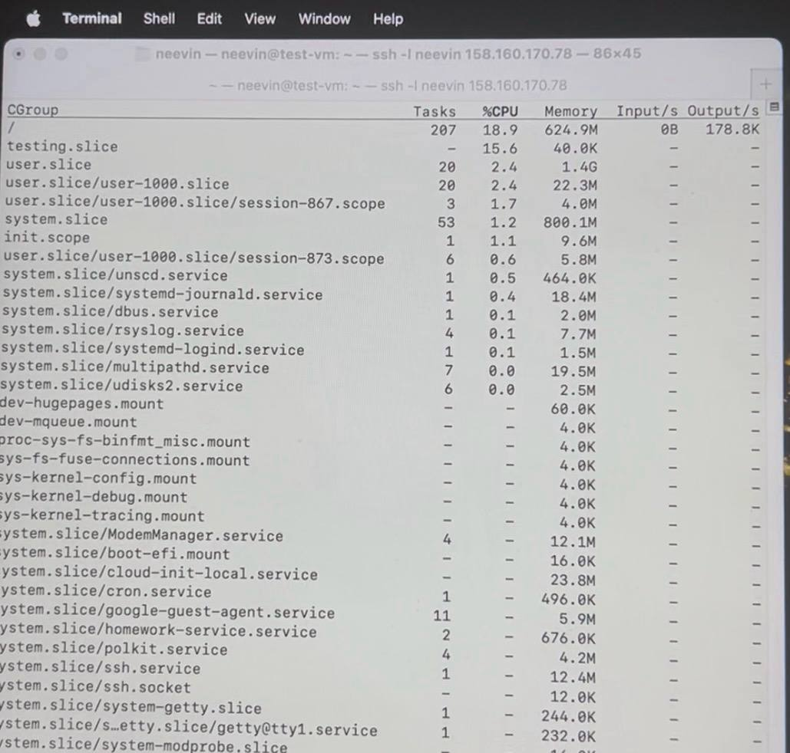
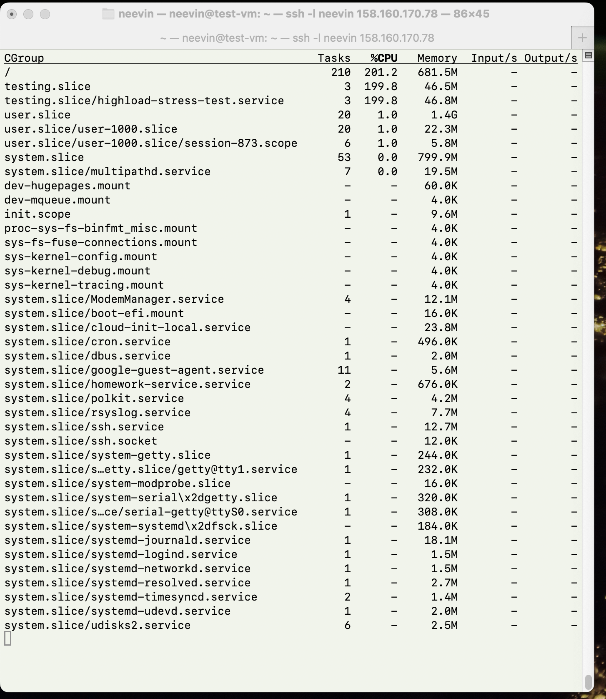

# Linux работа с памятью и процессами

## Задание 1. Systemd (25 баллов)

Создайте bash-скрипт `/usr/local/bin/homework_service.sh`:
```bash
neevin@test-vm:~$ sudo mkdir -p /usr/local/bin
neevin@test-vm:~$ sudo tee /usr/local/bin/homework_service.sh << 'EOF'
#!/bin/bash

echo "My custom service has started."

while true; do
  echo "Service heartbeat: $(date)" >> /tmp/homework_service.log
  sleep 15
done
EOF
neevin@test-vm:~$ sudo chmod a+x /usr/local/bin/homework_service.sh
```

Создайте systemd unit файл для скрипта, который бы переживал любые обновления системы. Убедитесь, что сервис сам перезапускается в случае падения через 15 секунд:
```bash
neevin@test-vm:~$ sudo tee /etc/systemd/system/homework-service.service << 'EOF'
[Unit]
Description=Homework Service
After=multi-user.target

[Service]
Type=simple
ExecStart=/usr/local/bin/homework_service.sh
Restart=always
RestartSec=15
User=neevin
Group=neevin

[Install]
WantedBy=multi-user.target
EOF
```
Зачастую ещё systemd unit запускается от пользователя и группы, созданной специально для этой службы (systemd unit).

Перезапускаем systemd, чтобы подгрузить новую конфигурацию для нашего сервиса:
```bash
neevin@test-vm:~$ sudo systemctl daemon-reload
```

Добавляем наш systemd unit в автозапуск ОС и запускаем его:
```bash
neevin@test-vm:~$ sudo systemctl enable homework-service.service
neevin@test-vm:~$ sudo systemctl start homework-service.service
neevin@test-vm:~$ sudo systemctl status homework-service.service
● homework-service.service - Homework Service
     Loaded: loaded (/etc/systemd/system/homework-service.service; enabled; preset: enabled)
     Active: active (running) since Sat 2025-10-04 13:46:08 UTC; 32s ago
   Main PID: 59803 (homework_servic)
      Tasks: 2 (limit: 4653)
     Memory: 604.0K (peak: 1.0M)
        CPU: 10ms
     CGroup: /system.slice/homework-service.service
             ├─59803 /bin/bash /usr/local/bin/homework_service.sh
             └─59901 sleep 15

Oct 04 13:46:08 test-vm systemd[1]: Started homework-service.service - Homework Service.
Oct 04 13:46:08 test-vm homework_service.sh[59803]: My custom service has started.
neevin@test-vm:~$ 
```

Сервис работает и логи успешно пишутся: 
```bash
neevin@test-vm:~$ tail -3 /tmp/homework_service.log
Service heartbeat: Sat Oct  4 13:50:08 UTC 2025
Service heartbeat: Sat Oct  4 13:50:23 UTC 2025
Service heartbeat: Sat Oct  4 13:50:38 UTC 2025
```

Проверяю, что работает перезапуск. Для этого убиваю процесс, а потом через systemctl и journalctl смотю статус и логи systemd unit. Как видно, сервис успешно перезапустился после падения через 15 секунд:
```bash
neevin@test-vm:~$ sudo pkill -f homework_service.sh
neevin@test-vm:~$ sudo systemctl status homework-service.service
● homework-service.service - Homework Service
     Loaded: loaded (/etc/systemd/system/homework-service.service; enabled; preset: enabled)
     Active: activating (auto-restart) since Sat 2025-10-04 13:53:35 UTC; 8s ago
    Process: 59803 ExecStart=/usr/local/bin/homework_service.sh (code=killed, signal=TERM)
   Main PID: 59803 (code=killed, signal=TERM)
        CPU: 87ms
neevin@test-vm:~$ sudo systemctl status homework-service.service
● homework-service.service - Homework Service
     Loaded: loaded (/etc/systemd/system/homework-service.service; enabled; preset: enabled)
     Active: active (running) since Sat 2025-10-04 13:53:50 UTC; 2s ago
   Main PID: 60073 (homework_servic)
      Tasks: 2 (limit: 4653)
     Memory: 580.0K (peak: 996.0K)
        CPU: 4ms
     CGroup: /system.slice/homework-service.service
             ├─60073 /bin/bash /usr/local/bin/homework_service.sh
             └─60075 sleep 15

Oct 04 13:53:50 test-vm systemd[1]: homework-service.service: Scheduled restart job, restart counter is at 1.
Oct 04 13:53:50 test-vm systemd[1]: Started homework-service.service - Homework Service.
Oct 04 13:53:50 test-vm homework_service.sh[60073]: My custom service has started.
neevin@test-vm:~$ sudo journalctl -u homework-service.service | tail -5
Oct 04 13:46:08 test-vm homework_service.sh[59803]: My custom service has started.
Oct 04 13:53:35 test-vm systemd[1]: homework-service.service: Deactivated successfully.
Oct 04 13:53:50 test-vm systemd[1]: homework-service.service: Scheduled restart job, restart counter is at 1.
Oct 04 13:53:50 test-vm systemd[1]: Started homework-service.service - Homework Service.
Oct 04 13:53:50 test-vm homework_service.sh[60073]: My custom service has started.
```

Используя systemd-analyze, покажите топ-5 systemd unit`ов стартующих дольше всего:
```bash
neevin@test-vm:~$ sudo systemd-analyze blame | head -5
15.033s homework-service.service
13.011s apt-daily.service
10.750s motd-news.service
 4.207s cloud-init.service
 3.909s cloud-config.service
```
Мой сервис занимает почётное первое место, потому что ему явно прописано джать 15 секунд перед перезапуском (`RestartSec=15`), если это значение уменьшить, то сервис будет перезапускаться быстрее.

## Задание 2. Межпроцессное взаимодействие (IPC) с разделяемой памятью (20 баллов)

На любом языке прогаммирования создайте програму использующую шареную память. Например shm_creator.c:
```bash
neevin@test-vm:~$ tee shm_creator.c << 'EOF'
#include <stdio.h>
#include <stdlib.h>
#include <sys/ipc.h>
#include <sys/shm.h>
#include <unistd.h>

int main() {
    key_t key = ftok("homework_key", 65); // Generate a unique key
    int shmid = shmget(key, 1024, 0666|IPC_CREAT); // Create 1KB segment
    if (shmid == -1) {
        perror("shmget");
        exit(1);
    }
    printf("Shared memory segment created.\n");
    printf("ID: %d\nKey: 0x%x\n", shmid, key);
    printf("Run 'ipcs -m' to see it. Process will exit in 60 seconds...\n");
    sleep(60);
    shmctl(shmid, IPC_RMID, NULL); // Clean up
    printf("Shared memory segment removed.\n");
    return 0;
}
EOF
```

Скомпилируйте и запустите:
```bash
neevin@test-vm:~$ gcc shm_creator.c -o shm_creator
neevin@test-vm:~$ touch homework_key
neevin@test-vm:~$ ./shm_creator
Shared memory segment created.
ID: 3
Key: 0x4101852e
Run 'ipcs -m' to see it. Process will exit in 60 seconds...
Shared memory segment removed.
```

Пока программа запущена (60 секунд), проанализируйте вывод. В соседнем терминале запустите ipcs -m. Обратите внимание на  nattch (number of attached processes) проанализируйте вывод:
```bash
neevin@test-vm:~$ ipcs -m

------ Shared Memory Segments --------
key        shmid      owner      perms      bytes      nattch     status      
0xffffffff 0          neevin     666        1024       0                       
0x4101852e 3          neevin     666        1024       0                       

neevin@test-vm:~$ ipcs -m -i 3

Shared memory Segment shmid=3
uid=1000	gid=1000	cuid=1000	cgid=1000
mode=0666	access_perms=0666
bytes=1024	lpid=0	cpid=67621	nattch=0
att_time=Not set                   
det_time=Not set                   
change_time=Sat Oct  4 19:53:55 2025  
```

`nattch = 0` означает, что количество подключенных процессов к блоку sharred memory равно 0, это потому что программа `shm_creator.c` только создает сегмент разделяемой памяти через `shmget()`, но не подключается к нему (`shmat()` не вызывается).

## Задание 3. Анализ памяти процессов (VSZ vs RSS) (20 баллов)

Откройте 1 окно терминала и запустите питон скрипт, который запрашивает 250 MiB памяти и держит ее 2 минуты:
```bash
neevin@test-vm:~$ python3 -c "print('Allocating memory...'); a = 'X' * (250 * 1024 * 1024); import time; print('Memory allocated. Sleeping...'); time.sleep(120);"
Allocating memory...
Memory allocated. Sleeping...
```
 
Пока скрипт запущен, откройте вторую вкладку, найдите там PID запущенного скрипта и проанализируйте использование RSS и VSZ:
```bash
neevin@test-vm:~$ ps uax | grep python
root         992  0.0  0.5 110012 22784 ?        Ssl  Sep30   0:00 /usr/bin/python3 /usr/share/unattended-upgrades/unattended-upgrade-shutdown --wait-for-signal
neevin     68199  0.6  6.6 274336 266112 pts/3   S+   20:16   0:00 python3 -c print('Allocating memory...'); a = 'X' * (250 * 1024 * 1024); import time; print('Memory allocated. Sleeping...'); time.sleep(120);
neevin     68208  0.0  0.0   7076  2176 pts/4    S+   20:17   0:00 grep --color=auto python

neevin@test-vm:~$ ps -o pid,user,%mem,rss,vsz,comm -p 68199
    PID USER     %MEM   RSS    VSZ COMMAND
  68199 neevin    6.6 266112 274336 python3
```

Объясните почему vsz больше rss, и почему rss далеко не 0.

Для начала переведу в мегабайты: `VSZ: 274336 kB ≈ 268 МБ`, `RSS: 266112 kB ≈ 260 МБ`, Запрошено: `250 МБ` (размер строки).

`VSZ` больше, чем `RSS`, потому что VSZ включает всю виртуальную память, часть которой может быть не загружена в физическую память. И как раз часть виртуальной памяти (может библиотеки/неиспользуемые страницы) не загружена в физическую память, в нашем случае составляет `8 МБ`.

`RSS` не равен 0 потому что `10 МБ` занимаем Python интерпретатор + системные библиотеки, а `250 МБ` - строка, python активно использует эту память и поэтому не выгружает её в swap.


## Задание 4. NUMA и cgroups (35 баллов)

Продемонстрируйте количество NUMA нод на вашем сервере и количество памяти для каждой NUMA ноды:
```bash
neevin@test-vm:~$ numactl --hardware
available: 1 nodes (0)
node 0 cpus: 0 1 2 3
node 0 size: 3914 MB
node 0 free: 1406 MB
node distances:
node   0 
  0:  10 
```

Убедитесь что вы можете ограничивать работу процессов при помощи systemd. Будет ли работать тест если мы запрашиваем 300М оперативной памяти, а ограничивыем 150М?
```bash
neevin@test-vm:~$ sudo systemd-run --unit=highload-stress-test --slice=testing.slice --property="MemoryMax=150M" --property="CPUWeight=100" stress --cpu 1 --vm 1 --vm-bytes 300M --timeout 30s
Running as unit: highload-stress-test.service; invocation ID: 3a6528b21dca4ab487448bfccbf05663
neevin@test-vm:~$ sudo systemctl status highload-stress-test.service
× highload-stress-test.service - /usr/bin/stress --cpu 1 --vm 1 --vm-bytes 300M --timeout 30s
     Loaded: loaded (/run/systemd/transient/highload-stress-test.service; transient)
  Transient: yes
     Active: failed (Result: oom-kill) since Sat 2025-10-04 20:46:05 UTC; 10s ago
   Duration: 87ms
    Process: 68862 ExecStart=/usr/bin/stress --cpu 1 --vm 1 --vm-bytes 300M --timeout 30s (code=exited, status=1/FAILURE)
   Main PID: 68862 (code=exited, status=1/FAILURE)
        CPU: 158ms

Oct 04 20:46:05 test-vm systemd[1]: Started highload-stress-test.service - /usr/bin/stress --cpu 1 --vm 1 --vm-bytes 300M --timeout 30s.
Oct 04 20:46:05 test-vm stress[68862]: stress: info: [68862] dispatching hogs: 1 cpu, 0 io, 1 vm, 0 hdd
Oct 04 20:46:05 test-vm stress[68862]: stress: FAIL: [68862] (425) <-- worker 68864 got signal 9
Oct 04 20:46:05 test-vm stress[68862]: stress: WARN: [68862] (427) now reaping child worker processes
Oct 04 20:46:05 test-vm stress[68862]: stress: FAIL: [68862] (461) failed run completed in 0s
Oct 04 20:46:05 test-vm systemd[1]: highload-stress-test.service: A process of this unit has been killed by the OOM killer.
Oct 04 20:46:05 test-vm systemd[1]: highload-stress-test.service: Main process exited, code=exited, status=1/FAILURE
Oct 04 20:46:05 test-vm systemd[1]: highload-stress-test.service: Failed with result 'oom-kill'.
neevin@test-vm:~$ 
```
systemd эффективно ограничивает unit'ы через cgroups, процессом было запрошено: `300 MБ` памяти, но в systemd было ограничение в `150 MБ` (`MemoryMax=150M`). И как результат его убил OOM-killer за привышение лимита, что видно из логов выше.

В соседней вкладке проследите за testing.slice при помощи systemd-cgls. Привысило ли использование памяти 150М ? Что происходит с процессом при превышении? Попробуйте использовать разные значения
```
neevin@test-vm:~$ sudo systemd-cgtop
```
Буквально на 1 секунду высвечивается `testing.slice` в выводе, но значение там всего `40 КБ`, а потом пропадает из-за убийства OOM-killer'ом:


Это происходит, потому что OOM-killer срабатывает на попытку, а не на факт использования:
- systemd видит запрос на выделение `300 MБ`
- systemd понимает, что это превысит лимит `150 MБ`
- Убивает процесс до фактического выделения 

Если указать `MemoryMax=3000M`, то процесс всё равно будет прибит:
```bash
neevin@test-vm:~$ sudo systemd-run --unit=highload-stress-test --slice=testing.slice --property="MemoryMax=300M" --property="CPUWeight=100" stress --cpu 1 --vm 1 --vm-bytes 300M --timeout 30s
Running as unit: highload-stress-test.service; invocation ID: 1813403703724076b50dde0b5addca22
neevin@test-vm:~$ sudo systemctl status highload-stress-test
× highload-stress-test.service - /usr/bin/stress --cpu 1 --vm 1 --vm-bytes 300M --time>
     Loaded: loaded (/run/systemd/transient/highload-stress-test.service; transient)
  Transient: yes
     Active: failed (Result: oom-kill) since Sat 2025-10-04 21:13:58 UTC; 21s ago
   Duration: 159ms
    Process: 69646 ExecStart=/usr/bin/stress --cpu 1 --vm 1 --vm-bytes 300M --timeout >
   Main PID: 69646 (code=killed, signal=TERM)
        CPU: 312ms

Oct 04 21:13:58 test-vm systemd[1]: Started highload-stress-test.service - /usr/bin/st>
Oct 04 21:13:58 test-vm stress[69646]: stress: info: [69646] dispatching hogs: 1 cpu, >
Oct 04 21:13:58 test-vm systemd[1]: highload-stress-test.service: A process of this un>
Oct 04 21:13:58 test-vm systemd[1]: highload-stress-test.service: Failed with result '>
```

А вот если указать `MemoryMax=305M`, то процесс запустится и будет работать:
```bash
neevin@test-vm:~$ sudo systemd-run --unit=highload-stress-test --slice=testing.slice --property="MemoryMax=305M" --property="CPUWeight=100" stress --cpu 1 --vm 1 --vm-bytes 300M --timeout 30s
Running as unit: highload-stress-test.service; invocation ID: 6857b77ebdef408e96b4571c200fc1bb
```
И его можно будет даже увидеть через `systemd-cgtop`:


Опишите что делает и для чего можно использовать `MemoryMax` and `CPUWeight`.
- `MemoryMax` устанавливает жесткий лимит использования памяти cgroup'ой, если выходит за рамки - процесс прибьёт OOM-killer.
- `CPUWeight` определяет относительный приоритет CPU (100-10000, по умолчанию 100). Это означает, systemd-unit'у с `CPUWeight=1000` будет выделено процессорного времени в 10 раз больше, чем systemd-unit'у с `CPUWeight=100`.
