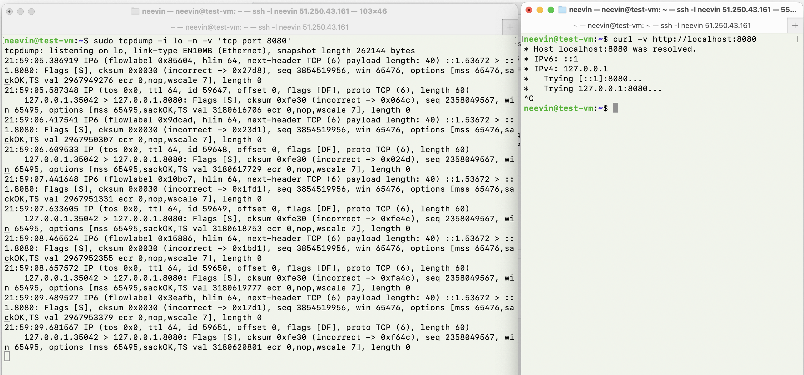

# Сетевой стек

## Задание 1. Анализ состояний TCP-соединений (25 баллов)
Запустите Python HTTP сервер на порту 8080:
```bash
neevin@test-vm:~$ python3 -m http.server 8080 &
[1] 2018
neevin@test-vm:~$ Serving HTTP on 0.0.0.0 port 8080 (http://0.0.0.0:8080/) ...
```

Проверяйте слушающие TCP-сокеты с помощью утилиты ss. найдите сокет с вашим http сервером:
```bash
neevin@test-vm:~$ ss -tlnp | grep 8080
LISTEN 0      5            0.0.0.0:8080      0.0.0.0:*    users:(("python3",pid=2018,fd=3))
```

Подключитесь к серверу через curl:
```bash
neevin@test-vm:~$ curl http://localhost:8080
127.0.0.1 - - [15/Oct/2025 18:50:47] "GET / HTTP/1.1" 200 -
<!DOCTYPE HTML>
<html lang="en">
<head>
<meta charset="utf-8">
<title>Directory listing for /</title>
</head>
<body>
<h1>Directory listing for /</h1>
<hr>
<ul>
<li><a href=".bash_history">.bash_history</a></li>
<li><a href=".bash_logout">.bash_logout</a></li>
<li><a href=".bashrc">.bashrc</a></li>
<li><a href=".cache/">.cache/</a></li>
<li><a href=".gitconfig">.gitconfig</a></li>
<li><a href=".gradle/">.gradle/</a></li>
<li><a href=".lesshst">.lesshst</a></li>
<li><a href=".local/">.local/</a></li>
<li><a href=".profile">.profile</a></li>
<li><a href=".ssh/">.ssh/</a></li>
<li><a href=".viminfo">.viminfo</a></li>
<li><a href=".wget-hsts">.wget-hsts</a></li>
<li><a href="async-profiler-2.10-linux-x64/">async-profiler-2.10-linux-x64/</a></li>
<li><a href="async-profiler-2.10-linux-x64.tar.gz">async-profiler-2.10-linux-x64.tar.gz</a></li>
<li><a href="highload-2025-task02-neevink/">highload-2025-task02-neevink/</a></li>
<li><a href="homework_key">homework_key</a></li>
<li><a href="shm_creator">shm_creator</a></li>
<li><a href="shm_creator.c">shm_creator.c</a></li>
<li><a href="wrk2/">wrk2/</a></li>
</ul>
<hr>
</body>
</html>
```

Проанализируйте состояние TCP-сокетов для порта 8080, объясните, почему есть сокет в состоянии TIME-WAIT, его роль и почему его нельзя удалить:
```bash
neevin@test-vm:~$ ss -tan | grep 8080
LISTEN    0      5            0.0.0.0:8080          0.0.0.0:*           
TIME-WAIT 0      0          127.0.0.1:8080        127.0.0.1:48286     
```
Если сделать ещё 1 день, то:
```bash
neevin@test-vm:~$ ss -tan | grep 8080
LISTEN     0      5            0.0.0.0:8080          0.0.0.0:*           
TIME-WAIT  0      0          127.0.0.1:8080        127.0.0.1:53518       
TIME-WAIT  0      0          127.0.0.1:8080        127.0.0.1:50698  
```
Спустя 120 секунд все TIME-WAIT коннекшены пропадают:
```bash
neevin@test-vm:~$ ss -tan | grep 8080
LISTEN     0      5            0.0.0.0:8080          0.0.0.0:* 
```
TIME-WAIT появляется после закрытия соединения на стороне, инициировавшей закрытие. Он длится 2×MSL (Maximum Segment Lifetime), обычно 60-120 секунд. TIME-WAIT гарантирует, что все пакеты соединения "умерли" в сети. И предотвращает повторное использование той же комбинации IP.

TIME-WAIT нельзя удалять, потому что он защищает от: дублирования пакетов из старого соединения и нужен для корректного завершения соединения.

Опишите, к каким проблемам может привести большое количество TIME-WAIT сокетов.
Потенциальные проблемы:
- Исчерпание локальных портов
- Потребление памяти ядра
- Достижение лимитов на количество открытых файловых дескрипторов

## Задание 2. Динамическая маршрутизация с BIRD (35 баллов)

Создайте dummy-интерфейс с адресом `192.168.14.88/32`, назовите его `service_0`:
```bash
neevin@test-vm:~$ sudo ip link add service_0 type dummy
neevin@test-vm:~$ sudo ip addr add 192.168.14.78/32 dev service_0
neevin@test-vm:~$ sudo ip link set service_0 up
neevin@test-vm:~$ ip a
1: lo: <LOOPBACK,UP,LOWER_UP> mtu 65536 qdisc noqueue state UNKNOWN group default qlen 1000
    link/loopback 00:00:00:00:00:00 brd 00:00:00:00:00:00
    inet 127.0.0.1/8 scope host lo
       valid_lft forever preferred_lft forever
    inet6 ::1/128 scope host noprefixroute 
       valid_lft forever preferred_lft forever
2: eth0: <BROADCAST,MULTICAST,UP,LOWER_UP> mtu 1500 qdisc mq state UP group default qlen 1000
    link/ether d0:0d:13:8c:50:b8 brd ff:ff:ff:ff:ff:ff
    altname enp138s0
    altname ens8
    inet 10.130.0.34/24 metric 100 brd 10.130.0.255 scope global dynamic eth0
       valid_lft 4294962308sec preferred_lft 4294962308sec
    inet6 fe80::d20d:13ff:fe8c:50b8/64 scope link 
       valid_lft forever preferred_lft forever
3: service_0: <BROADCAST,NOARP,UP,LOWER_UP> mtu 1500 qdisc noqueue state UNKNOWN group default qlen 1000
    link/ether e6:90:34:5a:79:f4 brd ff:ff:ff:ff:ff:ff
    inet 192.168.14.78/32 scope global service_0
       valid_lft forever preferred_lft forever
    inet6 fe80::e490:34ff:fe5a:79f4/64 scope link 
       valid_lft forever preferred_lft forever
```

При помощи BIRD проаннонсируйте этот адрес при помощи протокола RIP v2 включенного на вашем интерфейсе (eth0/ens33), а так же любой другой будущий адрес из подсети `192.168.14.0/24` но только если у него будет маска подсети /32 и имя будет начинаться на `service_`:
- Указываю router id `10.130.0.34` - этот адрес я взял с eth0 
- В `protocol direct` указываем `interface "service_*";`, чтобы следить только за нашим dummy0. И включаем его:
  ```
  protocol direct {
    interface "service_*"; 
    ipv4 ;                  # Connect to default IPv4 table
    ipv6;                   # ... and to default IPv6 table
  }
  ```
- Добавляем фильтр, который проверяет каждый маршрут на три условия и пропускает только подходящие:
  ```
  filter export_filter {
      if (net ~ 192.168.14.0/24 && net.len = 32 && ifname ~ "service_*") then {
          accept;
      }
      reject;
  } 
  ```
- Заполняем блок `protocol rip`, `export filter export_filter` - применяет наш фильтр к анонсам, 
`interface "eth0"` - указывает на каком интерфейсе работает RIP, `mode multicast` - использует RIPv2 (multicast).
  ```
  protocol rip {
      ipv4 {
          import all;
          export filter export_filter;
      };
      interface "eth0" {
          mode multicast;
          update time 30;
      };
  }
  ```

Получилась конфигурация: 
```bash
neevin@test-vm:~$ sudo cat /etc/bird/bird.conf
# This is a basic configuration file, which contains boilerplate options and
# some basic examples. It allows the BIRD daemon to start but will not cause
# anything else to happen.
#
# Please refer to the BIRD User's Guide documentation, which is also available
# online at http://bird.network.cz/ in HTML format, for more information on
# configuring BIRD and adding routing protocols.

# Configure logging
log syslog all;
# log "/var/log/bird.log" { debug, trace, info, remote, warning, error, auth, fatal, bug };

# Set router ID. It is a unique identification of your router, usually one of
# IPv4 addresses of the router. It is recommended to configure it explicitly.
router id 10.130.0.34;

# Turn on global debugging of all protocols (all messages or just selected classes)
# debug protocols all;
# debug protocols { events, states };

# Turn on internal watchdog
# watchdog warning 5 s;
# watchdog timeout 30 s;

# You can define your own constants
# define my_asn = 65000;
# define my_addr = 198.51.100.1;

# Tables master4 and master6 are defined by default
# ipv4 table master4;
# ipv6 table master6;

# Define more tables, e.g. for policy routing or as MRIB
# ipv4 table mrib4;
# ipv6 table mrib6;

# The Device protocol is not a real routing protocol. It does not generate any
# routes and it only serves as a module for getting information about network
# interfaces from the kernel. It is necessary in almost any configuration.
protocol device {
}

# The direct protocol is not a real routing protocol. It automatically generates
# direct routes to all network interfaces. Can exist in as many instances as you
# wish if you want to populate multiple routing tables with direct routes.
protocol direct {
	interface "service_*"; 
	ipv4 ;			# Connect to default IPv4 table
	ipv6;			# ... and to default IPv6 table
}

# The Kernel protocol is not a real routing protocol. Instead of communicating
# with other routers in the network, it performs synchronization of BIRD
# routing tables with the OS kernel. One instance per table.
filter export_filter {
    if (net ~ 192.168.14.0/24 && net.len = 32 && ifname ~ "service_*") then {
        accept;
    }
    reject;
}
protocol kernel {
	ipv4 {			# Connect protocol to IPv4 table by channel
#	      table master4;	# Default IPv4 table is master4
#	      import all;	# Import to table, default is import all
	      export all;	# Export to protocol. default is export none
	};
#	learn;			# Learn alien routes from the kernel
#	kernel table 10;	# Kernel table to synchronize with (default: main)
}

# Another instance for IPv6, skipping default options
protocol kernel {
	ipv6 { export all; };
}

# Static routes (Again, there can be multiple instances, for different address
# families and to disable/enable various groups of static routes on the fly).
protocol static {
	ipv4;			# Again, IPv4 channel with default options

#	route 0.0.0.0/0 via 198.51.100.10;
#	route 192.0.2.0/24 blackhole;
#	route 10.0.0.0/8 unreachable;
#	route 10.2.0.0/24 via "eth0";
#	# Static routes can be defined with optional attributes
#	route 10.1.1.0/24 via 198.51.100.3 { rip_metric = 3; };
#	route 10.1.2.0/24 via 198.51.100.3 { ospf_metric1 = 100; };
#	route 10.1.3.0/24 via 198.51.100.4 { ospf_metric2 = 100; };
}

# Pipe protocol connects two routing tables. Beware of loops.
# protocol pipe {
#	table master4;		# No ipv4/ipv6 channel definition like in other protocols
#	peer table mrib4;
#	import all;		# Direction peer table -> table
#	export all;		# Direction table -> peer table
# }

# RIP example, both RIP and RIPng are supported
protocol rip {
	ipv4 {
		import all;
		export filter export_filter;
	};
	interface "eth0" {
		mode multicast;
		update time 30;
	};
}

# OSPF example, both OSPFv2 and OSPFv3 are supported
# protocol ospf v3 {
#  	ipv6 {
#		import all;
#		export where source = RTS_STATIC;
#	};
#	area 0 {
#		interface "eth*" {
#			type broadcast;		# Detected by default
#			cost 10;		# Interface metric
#			hello 5;		# Default hello perid 10 is too long
#		};
#		interface "tun*" {
#			type ptp;		# PtP mode, avoids DR selection
#			cost 100;		# Interface metric
#			hello 5;		# Default hello perid 10 is too long
#		};
#		interface "dummy0" {
#			stub;			# Stub interface, just propagate it
#		};
#	};
#}

# Define simple filter as an example for BGP import filter
# See https://gitlab.labs.nic.cz/labs/bird/wikis/BGP_filtering for more examples
# filter rt_import
# {
#	if bgp_path.first != 64496 then accept;
#	if bgp_path.len > 64 then accept;
#	if bgp_next_hop != from then accept;
#	reject;
# }

# BGP example, explicit name 'uplink1' is used instead of default 'bgp1'
# protocol bgp uplink1 {
#	description "My BGP uplink";
#	local 198.51.100.1 as 65000;
#	neighbor 198.51.100.10 as 64496;
#	hold time 90;		# Default is 240
#	password "secret";	# Password used for MD5 authentication
#
#	ipv4 {			# regular IPv4 unicast (1/1)
#		import filter rt_import;
#		export where source ~ [ RTS_STATIC, RTS_BGP ];
#	};
#
#	ipv6 {			# regular IPv6 unicast (2/1)
#		import filter rt_import;
#		export filter {	# The same as 'where' expression above
#			if source ~ [ RTS_STATIC, RTS_BGP ]
#			then accept;
#			else reject;
#		};
#	};
#
#	ipv4 multicast {	# IPv4 multicast topology (1/2)
#		table mrib4;	# explicit IPv4 table
#		import filter rt_import;
#		export all;
#	};
#
#	ipv6 multicast {	# IPv6 multicast topology (2/2)
#		table mrib6;	# explicit IPv6 table
#		import filter rt_import;
#		export all;
#	};
#}

# Template example. Using templates to define IBGP route reflector clients.
# template bgp rr_clients {
#	local 10.0.0.1 as 65000;
#	neighbor as 65000;
#	rr client;
#	rr cluster id 1.0.0.1;
#
#	ipv4 {
#		import all;
#		export where source = RTS_BGP;
#	};
#
#	ipv6 {
#		import all;
#		export where source = RTS_BGP;
#	};
# }
#
# protocol bgp client1 from rr_clients {
#	neighbor 10.0.1.1;
# }
#
# protocol bgp client2 from rr_clients {
#	neighbor 10.0.2.1;
# }
#
# protocol bgp client3 from rr_clients {
#	neighbor 10.0.3.1;
# }
```

Перезупускаю:
```
neevin@test-vm:~$ sudo systemctl restart bird
```

Смотрю конфигурацию bird:
```bash
neevin@test-vm:~$ sudo birdc show route export rip1
BIRD 2.14 ready.
Table master4:
192.168.14.78/32     unicast [direct1 20:48:56.906] * (240)
	dev service_0
neevin@test-vm:~$ 
```

Создайте ещё три интерфейса `service_1 192.168.14.1/30`, `service_2 192.168.10.4/32`, `srv_1 192.168.14.4/32`:
```bash
neevin@test-vm:~$ sudo ip link add service_1 type dummy
neevin@test-vm:~$ sudo ip addr add 192.168.14.1/30 dev service_1
neevin@test-vm:~$ sudo ip link set service_1 up
neevin@test-vm:~$ sudo ip link add service_2 type dummy
neevin@test-vm:~$ sudo ip addr add 192.168.10.4/32 dev service_2
neevin@test-vm:~$ sudo ip link set service_2 up
neevin@test-vm:~$ sudo ip link add srv_1 type dummy
neevin@test-vm:~$ sudo ip addr add 192.168.14.4/32 dev srv_1
neevin@test-vm:~$ sudo ip link set srv_1 up
```

С помощью tcpdump докажите, что анонсируются только нужные адреса, без лишних.
```bash
neevin@test-vm:~$ sudo tcpdump -i eth0 -n -vv 'udp port 520'
tcpdump: listening on eth0, link-type EN10MB (Ethernet), snapshot length 262144 bytes
21:05:03.106556 IP (tos 0xc0, ttl 1, id 2891, offset 0, flags [none], proto UDP (17), length 52)
    10.130.0.34.520 > 224.0.0.9.520: [bad udp cksum 0xeade -> 0x3ff5!] 
	RIPv2, Response, length: 24, routes: 1 or less
	  AFI IPv4,   192.168.14.78/32, tag 0x0000, metric: 1, next-hop: self
	0x0000:  0202 0000 0002 0000 c0a8 0e4e ffff ffff
	0x0010:  0000 0000 0000 0001
```
Как и ожидалось, адрес правильно анонсируется по RIP.

## Задание 3. Настройка фаервола/ Host Firewalling (25 баллов)
С помощью iptables или nftables создайте правило, запрещающее подключения к порту 8080:
```bash
neevin@test-vm:~$ sudo nft add table inet filter
neevin@test-vm:~$ sudo nft add chain inet filter input { type filter hook input priority 0 \; }
neevin@test-vm:~$ sudo nft add rule inet filter input tcp dport 8080 drop
neevin@test-vm:~$ sudo nft list ruleset
table inet filter {
	chain input {
		type filter hook input priority filter; policy accept;
		tcp dport 8080 drop
	}
}
```

После этого я запустил python-сервер, отправил в него запрос через curl и в tcpdump увидел:
- SYN пакеты от клиента (флаг [S])
- Отсутствие SYN-ACK ответов, потому что пакеты за блокированы
- Повторные попытки SYN от клиента



## Задание 4. Аппаратное ускорение сетевого трафика (offloading) (15 баллов)

С помощью ethtool исследуйте offload возможности вашего сетевого адаптера. Покажите включён ли TCP segmentation offload:
```bash
neevin@test-vm:~$ sudo ethtool -k eth0 | grep -i tcp
tcp-segmentation-offload: on
	tx-tcp-segmentation: on
	tx-tcp-ecn-segmentation: on
	tx-tcp-mangleid-segmentation: off
	tx-tcp6-segmentation: on
```
TCP Segmentation Offload (TSO) активен на интерфейсе eth0. Сетевая карта разгружает CPU, самостоятельно сегментируя большие TCP-пакеты.

Объясните, какую задачу решает TCP segmentation offload.

TSO (TCP Segmentation Offload) - это функция сетевой карты (NIC), которая:
- Принимает от CPU большие блоки данных (например, 64 КБ).
- Самостоятельно разбивает их на мелкие пакеты по размеру MTU (обычно 1500 байт).
- Отправляет готовые пакеты в сеть, экономя ресурсы процессора.

Преимущества TSO в том, что он:
- Уменьшает нагрузку на CPU.
- Увеличивает пропускную способность (меньше накладных расходов).
