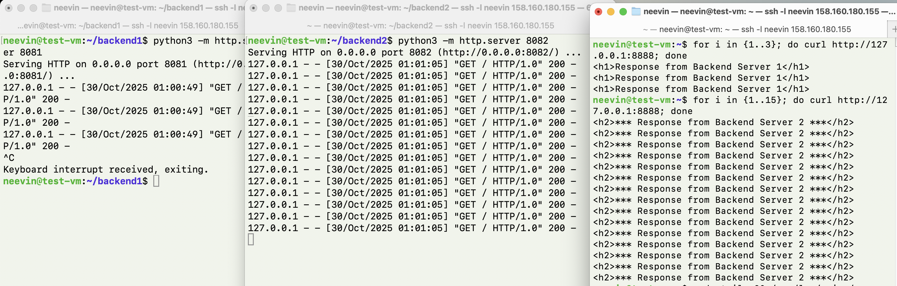

# WEB. High Performance WEB и CDN

## Задание 1. Создание Server Pool для backend (10 баллов)
Создайте у себя в home dir 2 папки ~/backend1 и ~/backend2, в каждой из которых должен лежать 1 index.html `"<h1>Response from Backend Server 1</h1>"` для backend1, `"<h2>*** Response from Backend Server 2 ***</h2>"`  для backend2, внутри этих папок запустите питоновый http сервер на портах 8081 и 8082 соответсвенно.
```bash
neevin@test-vm:~$ mkdir -p ~/backend1 ~/backend2
neevin@test-vm:~$ echo "<h1>Response from Backend Server 1</h1>" > ~/backend1/index.html
neevin@test-vm:~$ echo "<h2>*** Response from Backend Server 2 ***</h2>" > ~/backend2/index.html
neevin@test-vm:~$ 
```

Запускаю в первом окне `python3 -m http.server 8081`, во втором `python3 -m http.server 8082`, а в третьем проверяю работу через `curl`.


## Задание 2. DNS Load Balancing с помощью dnsmasq (20 баллов)

Для начала на `lo` в дополнение повешу адрес `127.0.0.2/8` (`127.0.0.1/8` уже был):
```bash
neevin@test-vm:~$ sudo ip a add 127.0.0.2/8 dev lo
neevin@test-vm:~$ ip a show lo
1: lo: <LOOPBACK,UP,LOWER_UP> mtu 65536 qdisc noqueue state UNKNOWN group default qlen 1000
    link/loopback 00:00:00:00:00:00 brd 00:00:00:00:00:00
    inet 127.0.0.1/8 scope host lo
       valid_lft forever preferred_lft forever
    inet 127.0.0.2/8 scope host secondary lo
       valid_lft forever preferred_lft forever
    inet6 ::1/128 scope host noprefixroute 
       valid_lft forever preferred_lft forever
neevin@test-vm:~$
```

При помощи dnsmasq создайте 2 A записи:
```bash
neevin@test-vm:~$ sudo cat /etc/dnsmasq.d/highload.conf
listen-address=127.0.0.1
address=/my-awesome-highload-app.local/127.0.0.1
address=/my-awesome-highload-app.local/127.0.0.2
port=53
neevin@test-vm:~$ sudo systemctl restart dnsmasq
```

```bash
neevin@test-vm:~$ dig @127.0.0.1 my-awesome-highload-app.local A

; <<>> DiG 9.18.39-0ubuntu0.24.04.2-Ubuntu <<>> @127.0.0.1 my-awesome-highload-app.local A
; (1 server found)
;; global options: +cmd
;; Got answer:
;; WARNING: .local is reserved for Multicast DNS
;; You are currently testing what happens when an mDNS query is leaked to DNS
;; ->>HEADER<<- opcode: QUERY, status: NOERROR, id: 45460
;; flags: qr aa rd ra; QUERY: 1, ANSWER: 2, AUTHORITY: 0, ADDITIONAL: 1

;; OPT PSEUDOSECTION:
; EDNS: version: 0, flags:; udp: 1232
;; QUESTION SECTION:
;my-awesome-highload-app.local.	IN	A

;; ANSWER SECTION:
my-awesome-highload-app.local. 0 IN	A	127.0.0.2
my-awesome-highload-app.local. 0 IN	A	127.0.0.1

;; Query time: 0 msec
;; SERVER: 127.0.0.1#53(127.0.0.1) (UDP)
;; WHEN: Wed Oct 29 23:24:47 UTC 2025
;; MSG SIZE  rcvd: 90

neevin@test-vm:~$ dig @127.0.0.1 my-awesome-highload-app.local A +short
127.0.0.2
127.0.0.1
neevin@test-vm:~$ 
```

Проанализируйте вывод, что произойдет с DNS записями если backend2 сервер сломается? 
Ничего не произойдёт, обе записи останутся существовать в DNS. DNS-балансировка не умеет динамически проверять статусы рилов и убирать сломанные бэкенды из под балансировки.

## Задание 3. Балансировка Layer 4 с  с помощью IPVS (35 баллов)

Создайте dummy1 интерфейс с адресом `192.168.100.1/32`:
```bash
neevin@test-vm:~$ sudo modprobe dummy
neevin@test-vm:~$ sudo ip link add dummy1 type dummy
neevin@test-vm:~$ sudo ip link set dummy1 up
neevin@test-vm:~$ sudo ip a add 192.168.100.1/32 dev dummy1
neevin@test-vm:~$ ip a show dummy1
3: dummy1: <BROADCAST,NOARP,UP,LOWER_UP> mtu 1500 qdisc noqueue state UNKNOWN group default qlen 1000
    link/ether 12:63:07:b0:ee:26 brd ff:ff:ff:ff:ff:ff
    inet 192.168.100.1/32 scope global dummy1
       valid_lft forever preferred_lft forever
    inet6 fe80::1063:7ff:feb0:ee26/64 scope link 
       valid_lft forever preferred_lft forever
neevin@test-vm:~$ 
```

Используя ipvsadm создайте VS для TCP порта 80 ведущего в `127.0.0.1:8081` и `127.0.0.1:8082` использующего round-robin тип балансировки:
```bash
neevin@test-vm:~$ sudo modprobe ip_vs
neevin@test-vm:~$ sudo modprobe ip_vs_rr
neevin@test-vm:~$ sudo ipvsadm -A -t 192.168.100.1:80 -s rr
neevin@test-vm:~$ sudo ipvsadm -a -t 192.168.100.1:80 -r 127.0.0.1:8081 -m
neevin@test-vm:~$ sudo ipvsadm -a -t 192.168.100.1:80 -r 127.0.0.1:8082 -m
neevin@test-vm:~$ sudo ipvsadm -L -n
IP Virtual Server version 1.2.1 (size=4096)
Prot LocalAddress:Port Scheduler Flags
  -> RemoteAddress:Port           Forward Weight ActiveConn InActConn
TCP  192.168.100.1:80 rr
  -> 127.0.0.1:8081               Masq    1      0          0         
  -> 127.0.0.1:8082               Masq    1      0          0         
neevin@test-vm:~$ 
```

Генерируем трафик (10 запросов):
```bash
neevin@test-vm:~$ for i in {1..10}; do
  echo "=== Запрос $i ==="
  curl http://192.168.100.1
  echo ""
done
=== Запрос 1 ===
<h2>*** Response from Backend Server 2 ***</h2>

=== Запрос 2 ===
<h1>Response from Backend Server 1</h1>

=== Запрос 3 ===
<h2>*** Response from Backend Server 2 ***</h2>

=== Запрос 4 ===
<h1>Response from Backend Server 1</h1>

=== Запрос 5 ===
<h2>*** Response from Backend Server 2 ***</h2>

=== Запрос 6 ===
<h1>Response from Backend Server 1</h1>

=== Запрос 7 ===
<h2>*** Response from Backend Server 2 ***</h2>

=== Запрос 8 ===
<h1>Response from Backend Server 1</h1>

=== Запрос 9 ===
<h2>*** Response from Backend Server 2 ***</h2>

=== Запрос 10 ===
<h1>Response from Backend Server 1</h1>
```

Проверяем как запросы распределились по рилам:
```bash
neevin@test-vm:~$ sudo ipvsadm -L -n --stats
IP Virtual Server version 1.2.1 (size=4096)
Prot LocalAddress:Port               Conns   InPkts  OutPkts  InBytes OutBytes
  -> RemoteAddress:Port
TCP  192.168.100.1:80                   10       69       60     4428     5490
  -> 127.0.0.1:8081                      5       35       30     2240     2725
  -> 127.0.0.1:8082                      5       34       30     2188     2765
neevin@test-vm:~$
```
Видно, что 5 запросов упало на 1 бэкенд и 5 на 2 бэкенд. Round-robin балансировка :)

## Задание 4. Балансировка L7 с помощью NGINX (35 баллов)

Создайте пул из  127.0.0.1:8081 и 127.0.0.1:8082 в nginx с active-backup балансировкой.
Nginx должен слушать только 127.0.0.1 tcp порт 8888 и проставлять заголовок X-high-load-test 123 проксируя в аптсрим.
```bash
neevin@test-vm:~$ sudo cat /etc/nginx/sites-available/highload
upstream backend_pool {
    # Active
    server 127.0.0.1:8081 max_fails=7 fail_timeout=30s;
    # Backup
    server 127.0.0.1:8082 backup;
}

server {
    listen 127.0.0.1:8888;
    server_name localhost;

    location / {
        proxy_pass http://backend_pool;
        
        proxy_set_header X-high-load-test "123";
        
        proxy_connect_timeout 1s;
        proxy_send_timeout 1s;
        proxy_read_timeout 1s;
    }
}
neevin@test-vm:~$ sudo cat /etc/nginx/sites-available/highload
upstream backend_pool {
    server 127.0.0.1:8081 max_fails=7 fail_timeout=10s;
    server 127.0.0.1:8082 backup;
}

server {
    listen 127.0.0.1:8888;
    
    location / {
        proxy_pass http://backend_pool;
        proxy_set_header X-high-load-test "123";
        proxy_set_header Host $host;
        
        proxy_connect_timeout 1s;
    }
}
neevin@test-vm:~$ sudo ln -sf /etc/nginx/sites-available/highload /etc/nginx/sites-enabled/
neevin@test-vm:~$ sudo rm -f /etc/nginx/sites-enabled/default
neevin@test-vm:~$ sudo nginx -t
nginx: the configuration file /etc/nginx/nginx.conf syntax is ok
nginx: configuration file /etc/nginx/nginx.conf test is successful
neevin@test-vm:~$ sudo systemctl restart nginx
```

После запуска балансировщик нагрузки запустился и на все запросы отвечает активный сервер:
```bash
neevin@test-vm:~/backend2$ curl http://127.0.0.1:8888
127.0.0.1 - - [30/Oct/2025 00:08:50] "GET / HTTP/1.0" 200 -
<h1>Response from Backend Server 1</h1>
neevin@test-vm:~/backend2$ curl http://127.0.0.1:8888
127.0.0.1 - - [30/Oct/2025 00:08:51] "GET / HTTP/1.0" 200 -
<h1>Response from Backend Server 1</h1>
neevin@test-vm:~/backend2$ curl http://127.0.0.1:8888
127.0.0.1 - - [30/Oct/2025 00:08:52] "GET / HTTP/1.0" 200 -
<h1>Response from Backend Server 1</h1>
neevin@test-vm:~/backend2$ curl http://127.0.0.1:8888
127.0.0.1 - - [30/Oct/2025 00:08:53] "GET / HTTP/1.0" 200 -
<h1>Response from Backend Server 1</h1>
neevin@test-vm:~/backend2$ 
```

Убедитесь, что переключение на backup сервер происходит после 7 неудачных попыток сходить в активный сервер.

У меня не получилось сконфигурировать:
1. Чтобы ошибки недоступности backend1 прокидывались в ответ за балансером. В моей конфигурации он пробовал сходить на backend1 и в случае неудачи отправлял на backend2.
2. Судя по логам (было записано всего 7 сообщений) после 7 неудач он просто перестал отправлять запросы на active и сразу отправлял на bacup:
   ```
    neevin@test-vm:~$ sudo cat /var/log/nginx/error.log
    2025/10/30 01:01:05 [error] 65700#65700: *132 connect() failed (111: Connection refused) while connecting to upstream, client: 127.0.0.1, server: , request: "GET / HTTP/1.1", upstream: "http://127.0.0.1:8081/", host: "127.0.0.1:8888"
    2025/10/30 01:01:05 [error] 65700#65700: *135 connect() failed (111: Connection refused) while connecting to upstream, client: 127.0.0.1, server: , request: "GET / HTTP/1.1", upstream: "http://127.0.0.1:8081/", host: "127.0.0.1:8888"
    2025/10/30 01:01:05 [error] 65700#65700: *138 connect() failed (111: Connection refused) while connecting to upstream, client: 127.0.0.1, server: , request: "GET / HTTP/1.1", upstream: "http://127.0.0.1:8081/", host: "127.0.0.1:8888"
    2025/10/30 01:01:05 [error] 65700#65700: *141 connect() failed (111: Connection refused) while connecting to upstream, client: 127.0.0.1, server: , request: "GET / HTTP/1.1", upstream: "http://127.0.0.1:8081/", host: "127.0.0.1:8888"
    2025/10/30 01:01:05 [error] 65700#65700: *144 connect() failed (111: Connection refused) while connecting to upstream, client: 127.0.0.1, server: , request: "GET / HTTP/1.1", upstream: "http://127.0.0.1:8081/", host: "127.0.0.1:8888"
    2025/10/30 01:01:05 [error] 65700#65700: *147 connect() failed (111: Connection refused) while connecting to upstream, client: 127.0.0.1, server: , request: "GET / HTTP/1.1", upstream: "http://127.0.0.1:8081/", host: "127.0.0.1:8888"
    2025/10/30 01:01:05 [error] 65700#65700: *150 connect() failed (111: Connection refused) while connecting to upstream, client: 127.0.0.1, server: , request: "GET / HTTP/1.1", upstream: "http://127.0.0.1:8081/", host: "127.0.0.1:8888"
   ```

Покажите при помощи tshark http запрос и ответ:
Слева - запущенный бэкенд, посередине tshark, справа curl, который делает запрос в балансер.


Заголовок в запросе в действительно проставляется при помощи nginx:
```bash
neevin@test-vm:~$ cat ~/tshark_capture.txt | grep 123
    X-high-load-test: 123\r\n
neevin@test-vm:~$ 
```

frame 4 (запрос от curl в nginx):
```
Hypertext Transfer Protocol
    GET / HTTP/1.1\r\n
        [Expert Info (Chat/Sequence): GET / HTTP/1.1\r\n]
            [GET / HTTP/1.1\r\n]
            [Severity level: Chat]
            [Group: Sequence]
        Request Method: GET
        Request URI: /
        Request Version: HTTP/1.1
    Host: 127.0.0.1:8888\r\n
    User-Agent: curl/8.5.0\r\n
    Accept: */*\r\n
    \r\n
    [Full request URI: http://127.0.0.1:8888/]
    [HTTP request 1/1]


```

frame 9 (от nginx в backend1):
```
Hypertext Transfer Protocol
    GET / HTTP/1.0\r\n
        [Expert Info (Chat/Sequence): GET / HTTP/1.0\r\n]
            [GET / HTTP/1.0\r\n]
            [Severity level: Chat]
            [Group: Sequence]
        Request Method: GET
        Request URI: /
        Request Version: HTTP/1.0
    X-high-load-test: 123\r\n
    Host: 127.0.0.1\r\n
    Connection: close\r\n
    User-Agent: curl/8.5.0\r\n
    Accept: */*\r\n
    \r\n
    [Full request URI: http://127.0.0.1/]
    [HTTP request 1/1]
```

frame 13 (от backend1 к nginx):
```
Hypertext Transfer Protocol
    HTTP/1.0 200 OK\r\n
        [Expert Info (Chat/Sequence): HTTP/1.0 200 OK\r\n]
            [HTTP/1.0 200 OK\r\n]
            [Severity level: Chat]
            [Group: Sequence]
        Response Version: HTTP/1.0
        Status Code: 200
        [Status Code Description: OK]
        Response Phrase: OK
    Server: SimpleHTTP/0.6 Python/3.12.3\r\n
    Date: Thu, 30 Oct 2025 01:14:03 GMT\r\n
    Content-type: text/html\r\n
    Content-Length: 40\r\n
        [Content length: 40]
    Last-Modified: Wed, 29 Oct 2025 22:57:21 GMT\r\n
    \r\n
    [HTTP response 1/1]
    [Time since request: 0.004154234 seconds]
    [Request in frame: 9]
    [Request URI: http://127.0.0.1/]
    File Data: 40 bytes
Line-based text data: text/html (1 lines)
    <h1>Response from Backend Server 1</h1>\n
```

frame 17 (от nginx в curl) почти тоже самое что и в frame 13.
 